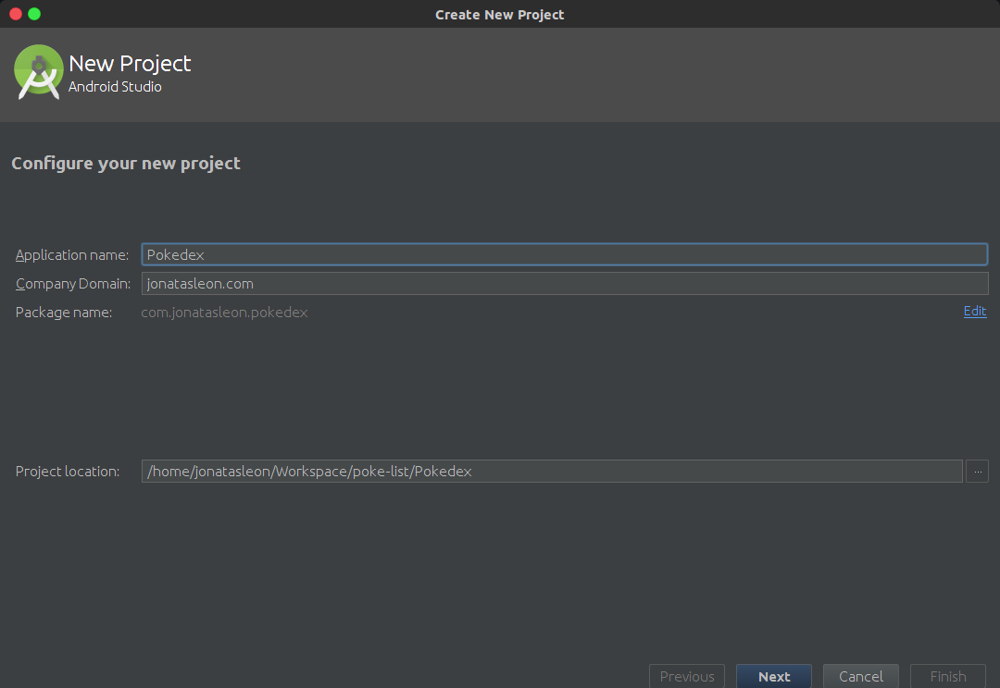
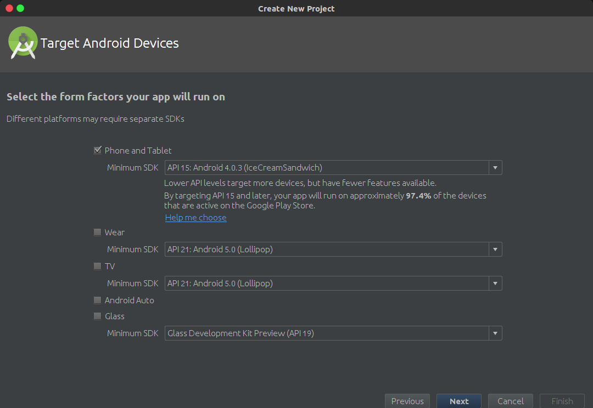
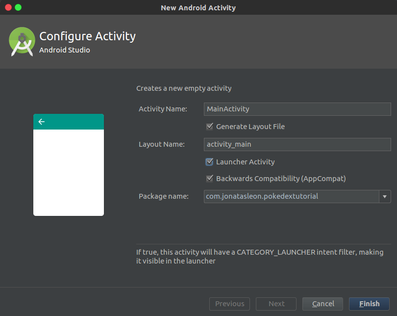
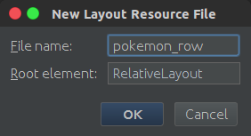

# Apostila

Essa apostila mostra o desenvolvimento passo-a-passo de um aplicação demo de um lista de Pokemons. A função principal do aplicativo será consumir a API [PokeAPI](https://pokeapi.co), que se trata de uma API sobre Pokemons destinada a fins educacionais e gratuita.

## Criando projeto no Android Studio
Ao abrir o Android Studio, uma tela de boas-vindas será exibida(Figura 1), clique em *Start a new Android Studio Project*.


<sub>**Figura 1** - Tela Welcome</sub>

Agora na tela de criação de um novo projeto(Figura 2), insira o nome da aplicação (*Application name*), um domínio(*Company Domain*), para exemplo coloque seu nome seguido de *.com*, e ao final escolha onde ficará a pasta do projeto(*Projeto Location*), clique em Next.



<sub>**Figura 2** - Tela New Project</sub>

Como mostrado na Figura 3, deixe apenas selecionado a opção *Phone and Tablet*, com o *Minimum SDK* em *API 15: Android 4.0.3 (IceCreamSandwich)*, então clique em Next



<sub>**Figura 3** - Tela Target Devices</sub>

Selecione a opção *Add no activity*, como mostrado(Figura 4), então clique em *Finish*


<sub>**Figura 4** - Tela Add Activity</sub>

Após isso, a estrutura de arquivos do seu projeto vai fica assim:


<sub>**Figura 5** - Estrutura de arquivos</sub>

Pronto, agora seu projeto está criado.

## Configurando o projeto

Para construirmos estes aplicativo utilizaremos algumas ferramentas para facilitar o desenvolvimento, além de termos que configura-lo para realizar algumas tarefas.

Como o aplicativo irá buscar as informações na internet, temos que informar que ele fará isso no arquivo **AndroidManifest.xml**. Abra o arquivo e adicione, dentro da tag *manifest*, o seguinte trecho de código:

```xml
<uses-permission android:name="android.permission.INTERNET"/>
```
<sub>**Código 1** - Permissão para internet</sub>

Abra o arquivo build.gradle e adicione as bibliotecas de design e recyclerview, elas oferecem suporte a dispositivos com versões do Android anteriores ao Android Lollipop, adicione também as bibliotecas para parse de dados, *GSON* e a *Retrofit*.

```js
dependencies {
    compile fileTree(dir: 'libs', include: ['*.jar'])
    testCompile 'junit:junit:4.12'
    compile 'com.android.support:appcompat-v7:23.4.0'

    // libs de compatibilidade
    compile 'com.android.support:design:23.4.0'
    compile 'com.android.support:recyclerview-v7:23.4.0'

    // retrofit, gson
    compile 'com.google.code.gson:gson:2.7'
    compile 'com.squareup.retrofit2:retrofit:2.1.0'
    compile 'com.squareup.retrofit2:converter-gson:2.1.0'
}
```
<sub>**Código 2** - Adicionando as dependências</sub>

## Criando nossa primeira Activity

Agora que tudo está configurado, vamos criar nossa primeira Activity e assim já ter alguma tela para visualizarmos no emulador/celular

Expanda a estrutura de visualização dos arquivos até exibir o nome do pacote, na imagem de exemplo(Figura 6) é *com.jonatasleon.pokedex*, então clique com o botão direito e vá em *New -> Activity -> Empty Activity*.


<sub>**Figura 6** - Estrutura de arquivos</sub>

Como na Figura 7, lembre-se de marcar a opção *Launcher Activity*, então clique em Finish



<sub>**Figura 7** - Nova Activity</sub>

Abra o arquivo **activity_main.xml** e mude para o modo text, altere o componente RelativeLayout e adicione um RecyclerView para que o arquivo fique assim:

```xml
<?xml version="1.0" encoding="utf-8"?>
<RelativeLayout
    xmlns:android="http://schemas.android.com/apk/res/android"
    xmlns:tools="http://schemas.android.com/tools"
    xmlns:app="http://schemas.android.com/apk/res-auto"
    android:layout_width="match_parent"
    android:layout_height="match_parent"
    app:layout_behavior="@string/appbar_scrolling_view_behavior"
    tools:showIn="@layout/activity_main"
    tools:context="com.jonatasleon.pokedex.MainActivity">

    <android.support.v7.widget.RecyclerView
        android:id="@+id/rv_pokemons"
        android:layout_width="match_parent"
        android:layout_height="match_parent"
        android:scrollbars="vertical" />

</RelativeLayout>
```

<sub>**Código 3** - Arquivo activity_main.xml</sub>

Voltando para o modo Design, é exibido uma prévia de como ficaria o layout.


<sub>**Figura 8** - Prévia do Layout</sub>

Agora adicione uma nova classe, clique sobre o nome do pacote novamente, *New -> Java Class*, coloque o nome da classe como **Pokemon** e clique em *OK*.


<sub>**Figura 9** - Nova classe</sub>

O Pokemon terá, por enquanto, dois atributos, *name* e *type*. Adicione dois construtores públicos, o primeiro sem paramêtros, o segundo contendo os atributos criados como paramêtro. Após isso, adicione getters e setters para cada atributo. O código final do arquivo **Pokemon.java** deve ser semelhante a:

```java
package com.jonatasleon.pokedex;

public class Pokemon {

    private String name;
    private String type;

    public Pokemon() {

    }
    public Pokemon(String name, String type) {
        this.name = name;
        this.type = type;
    }

    public String getName() {
        return name;
    }

    public void setName(String name) {
        this.name = name;
    }

    public String getType() {
        return type;
    }

    public void setType(String type) {
        this.type = type;
    }
}
```

<sub>**Código 4** - Pokemon.java</sub>

Agora, crie um novo layout. Clique com o botão direito sobre a pasta **layout**(*Figura 10*)


<sub>**Figura 10** - Pasta layout</sub>

Então coloque como nome **pokemon_row** e em *Root Element* digite *RelativeLayout*, aperte *OK*



<sub>**Figura 11** - Adiciona layout pokemon_row</sub>

Abra o arquivo **pokemon_row.xml** e deixe-o assim:

```xml
<?xml version="1.0" encoding="utf-8"?>
<RelativeLayout
    xmlns:android="http://schemas.android.com/apk/res/android"
    android:layout_width="match_parent"
    android:layout_height="wrap_content"
    android:focusable="true"
    android:paddingLeft="16dp"
    android:paddingRight="16dp"
    android:paddingTop="10dp"
    android:paddingBottom="10dp"
    android:clickable="true"
    android:background="?android:attr/selectableItemBackground"
    android:orientation="vertical">

    <TextView
        android:id="@+id/tv_name"
        android:textSize="16sp"
        android:textStyle="bold"
        android:layout_alignParentTop="true"
        android:layout_width="match_parent"
        android:layout_height="wrap_content" />

    <TextView
        android:id="@+id/tv_type"
        android:layout_below="@id/name"
        android:layout_width="match_parent"
        android:layout_height="wrap_content" />

</RelativeLayout>
```

<sub>**Código 5** - Pokemon row layout</sub>

Agora crie uma class chamada **PokemonAdapter**, essa classe será feito a ponte entre os dados e o layout exibido pela activity, abra o arquivo **PokemonAdapter.java** e deixo assim:
```java
package com.jonatasleon.pokedex;

import android.support.v7.widget.RecyclerView;
import android.view.LayoutInflater;
import android.view.View;
import android.view.ViewGroup;
import android.widget.TextView;

import java.util.List;

public class PokemonAdapter extends RecyclerView.Adapter<PokemonAdapter.PokeViewHolder> {

    private List<Pokemon> pokeList;

    public class PokeViewHolder extends RecyclerView.ViewHolder {
        public TextView name, type;

        public PokeViewHolder(View itemView) {
            super(itemView);
            name = (TextView) itemView.findViewById(R.id.tv_name);
            type = (TextView) itemView.findViewById(R.id.tv_type);
        }
    }

    public PokemonAdapter(List<Pokemon> pokeList) {
        this.pokeList = pokeList;
    }

    @Override
    public PokeViewHolder onCreateViewHolder(ViewGroup parent, int viewType) {
        View itemView = LayoutInflater.from(parent.getContext())
                .inflate(R.layout.pokemon_row, parent, false);

        return new PokeViewHolder(itemView);
    }

    @Override
    public void onBindViewHolder(PokeViewHolder holder, int position) {
        Pokemon pokemon = pokeList.get(position);
        holder.name.setText(pokemon.getName());
        holder.type.setText(pokemon.getType());
    }

    @Override
    public int getItemCount() {
        return pokeList.size();
    }
}
```

<sub>**Código 5** - PokemonAdapter.java</sub>

Abra o arquivo **MainActivity.java** e deixo modifique o método *onCreate*:

```java    
  @Override
  protected void onCreate(Bundle savedInstanceState) {
      super.onCreate(savedInstanceState);
      setContentView(R.layout.activity_main);

      recyclerView = (RecyclerView) findViewById(R.id.rv_pokemons);

      pokemonAdapter = new PokemonAdapter(pokeList);

      RecyclerView.LayoutManager layoutManager;
      layoutManager = new LinearLayoutManager(getApplicationContext());

      recyclerView.setLayoutManager(layoutManager);
      recyclerView.setItemAnimator(new DefaultItemAnimator());
      recyclerView.setAdapter(pokemonAdapter);
  }
```

<sub>**Código 6** - Método onCreate</sub>

Agora o *RecyclerView* já está implementado, no entanto nenhuma informação é exibida, vamos criar um método que adicione algum dado. Dentro da classe **MainActivity** crie um método addData:

```java    
private void addData() {
  Pokemon poke;

  poke = new Pokemon("Bulbasaur", "Grama");
  pokeList.add(poke);

  poke = new Pokemon("Charmander", "Fogo");
  pokeList.add(poke);

  poke = new Pokemon("Squirtle", "Água");
  pokeList.add(poke);

  pokemonAdapter.notifyDataSetChanged();
}
```

<sub>**Código 7** - Método addData</sub>

O código da **MainActivity** deve ser algo como:

```java
package com.jonatasleon.pokedex;

import android.support.v7.app.AppCompatActivity;
import android.os.Bundle;
import android.support.v7.widget.DefaultItemAnimator;
import android.support.v7.widget.LinearLayoutManager;
import android.support.v7.widget.RecyclerView;

import java.util.ArrayList;
import java.util.List;

public class MainActivity extends AppCompatActivity {

  List<Pokemon> pokeList = new ArrayList<>();
  RecyclerView recyclerView;
  PokemonAdapter pokemonAdapter;

  @Override
  protected void onCreate(Bundle savedInstanceState) {
    super.onCreate(savedInstanceState);
    setContentView(R.layout.activity_main);

    recyclerView = (RecyclerView) findViewById(R.id.rv_pokemons);

    pokemonAdapter = new PokemonAdapter(pokeList);

    RecyclerView.LayoutManager layoutManager;
    layoutManager = new LinearLayoutManager(getApplicationContext());

    recyclerView.setLayoutManager(layoutManager);
    recyclerView.setItemAnimator(new DefaultItemAnimator());
    recyclerView.setAdapter(pokemonAdapter);

    addData();
  }

  private void addData() {
    Pokemon poke;

    poke = new Pokemon("Bulbasaur", "Grama");
    pokeList.add(poke);

    poke = new Pokemon("Charmander", "Fogo");
    pokeList.add(poke);

    poke = new Pokemon("Squirtle", "Água");
    pokeList.add(poke);

    pokemonAdapter.notifyDataSetChanged();
  }
}

```

<sub>**Código 8** - MainActivity completa</sub>

Ao executar o aplicativo, o resultado esperado seria uma lista com os 3 Pokemons adicionados no método addData.


<sub>**Figura 12** - Resultado Esperado</sub>
