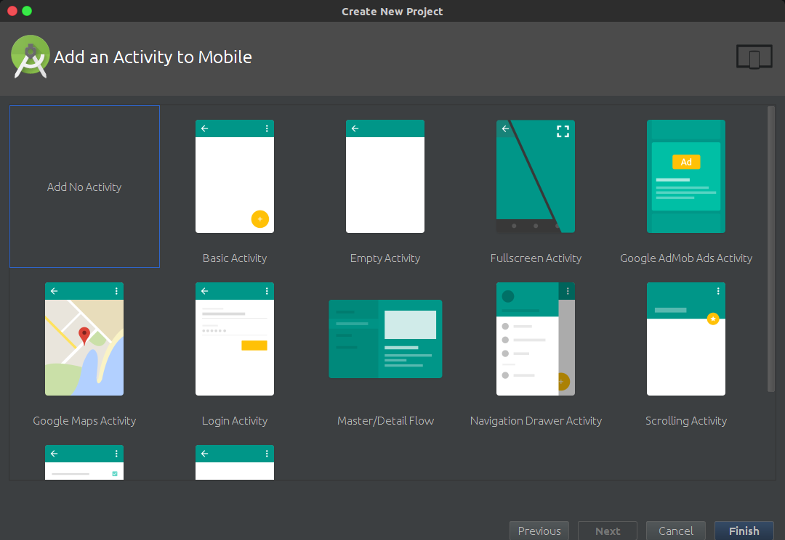
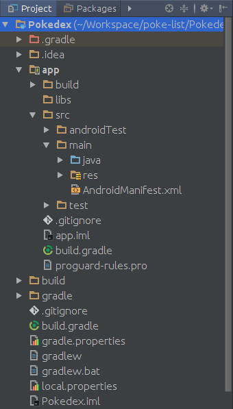
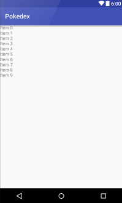
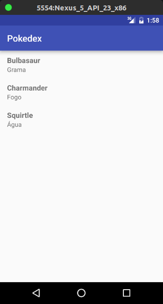

# Apostila

Essa apostila mostra o desenvolvimento passo-a-passo de um aplicação demo de um lista de Pokemons. A função principal do aplicativo será consumir a API [PokéAPI](https://pokeapi.co), que se trata de uma API sobre Pokemons destinada a fins educacionais e gratuita.

## Criando projeto no Android Studio
Ao abrir o Android Studio, uma tela de boas-vindas será exibida(Figura 1), clique em *Start a new Android Studio Project*.


<sub>**Figura 1** - Tela Welcome</sub>

Agora na tela de criação de um novo projeto(Figura 2), insira o nome da aplicação (*Application name*), um domínio(*Company Domain*), para exemplo coloque seu nome seguido de *.com*, e ao final escolha onde ficará a pasta do projeto(*Projeto Location*), clique em Next.


<sub>**Figura 2** - Tela New Project</sub>

Como mostrado na Figura 3, deixe apenas selecionado a opção *Phone and Tablet*, com o *Minimum SDK* em *API 15: Android 4.0.3 (IceCreamSandwich)*, então clique em Next


<sub>**Figura 3** - Tela Target Devices</sub>

Selecione a opção *Add no activity*, como mostrado(Figura 4), então clique em *Finish*



<sub>**Figura 4** - Tela Add Activity</sub>

Após isso, a estrutura de arquivos do seu projeto vai fica assim:



<sub>**Figura 5** - Estrutura de arquivos</sub>

Pronto, agora seu projeto está criado.

## Configurando o projeto

Para construirmos estes aplicativo utilizaremos algumas ferramentas para facilitar o desenvolvimento, além de termos que configura-lo para realizar algumas tarefas.

Como o aplicativo irá buscar as informações na internet, temos que informar que ele fará isso no arquivo **AndroidManifest.xml**. Abra o arquivo e adicione, dentro da tag *manifest*, o seguinte trecho de código:

```xml
<uses-permission android:name="android.permission.INTERNET"/>
```
<sub>**Código 1** - Permissão para internet</sub>

Abra o arquivo build.gradle e adicione as bibliotecas de design e recyclerview, elas oferecem suporte a dispositivos com versões do Android anteriores ao Android Lollipop, adicione também as bibliotecas para parse de dados, *GSON* e a *Retrofit*.

```js
dependencies {
    compile fileTree(dir: 'libs', include: ['*.jar'])
    testCompile 'junit:junit:4.12'
    compile 'com.android.support:appcompat-v7:23.4.0'

    // libs de compatibilidade
    compile 'com.android.support:design:23.4.0'
    compile 'com.android.support:recyclerview-v7:23.4.0'

    // retrofit, gson
    compile 'com.google.code.gson:gson:2.7'
    compile 'com.squareup.retrofit2:retrofit:2.1.0'
    compile 'com.squareup.retrofit2:converter-gson:2.1.0'
}
```
<sub>**Código 2** - Adicionando as dependências</sub>

## Criando nossa primeira Activity

Agora que tudo está configurado, vamos criar nossa primeira Activity e assim já ter alguma tela para visualizarmos no emulador/celular

Expanda a estrutura de visualização dos arquivos até exibir o nome do pacote, na imagem de exemplo(Figura 6) é *com.jonatasleon.pokedex*, então clique com o botão direito e vá em *New -> Activity -> Empty Activity*.


<sub>**Figura 6** - Estrutura de arquivos</sub>

Como na Figura 7, lembre-se de marcar a opção *Launcher Activity*, então clique em Finish


<sub>**Figura 7** - Nova Activity</sub>

Abra o arquivo **activity_main.xml** e mude para o modo text, altere o componente RelativeLayout e adicione um RecyclerView para que o arquivo fique assim:

```xml
<?xml version="1.0" encoding="utf-8"?>
<RelativeLayout
    xmlns:android="http://schemas.android.com/apk/res/android"
    xmlns:tools="http://schemas.android.com/tools"
    xmlns:app="http://schemas.android.com/apk/res-auto"
    android:layout_width="match_parent"
    android:layout_height="match_parent"
    app:layout_behavior="@string/appbar_scrolling_view_behavior"
    tools:showIn="@layout/activity_main"
    tools:context="com.jonatasleon.pokedex.MainActivity">

    <android.support.v7.widget.RecyclerView
        android:id="@+id/rv_pokemons"
        android:layout_width="match_parent"
        android:layout_height="match_parent"
        android:scrollbars="vertical" />

</RelativeLayout>
```

<sub>**Código 3** - Arquivo activity_main.xml</sub>

Voltando para o modo Design, é exibido uma prévia de como ficaria o layout.



<sub>**Figura 8** - Prévia do Layout</sub>

Agora adicione uma nova classe, clique sobre o nome do pacote novamente, *New -> Java Class*, coloque o nome da classe como **Pokemon** e clique em *OK*.


<sub>**Figura 9** - Nova classe</sub>

O Pokemon terá, por enquanto, dois atributos, *name* e *type*. Adicione dois construtores públicos, o primeiro sem paramêtros, o segundo contendo os atributos criados como paramêtro. Após isso, adicione getters e setters para cada atributo. O código final do arquivo **Pokemon.java** deve ser semelhante a:

```java
package com.jonatasleon.pokedex;

public class Pokemon {

    private String name;
    private String type;

    public Pokemon() {

    }
    public Pokemon(String name, String type) {
        this.name = name;
        this.type = type;
    }

    public String getName() {
        return name;
    }

    public void setName(String name) {
        this.name = name;
    }

    public String getType() {
        return type;
    }

    public void setType(String type) {
        this.type = type;
    }
}
```

<sub>**Código 4** - Pokemon.java</sub>

Agora, crie um novo layout. Clique com o botão direito sobre a pasta **layout**(*Figura 10*)


<sub>**Figura 10** - Pasta layout</sub>

Então coloque como nome **pokemon_row** e em *Root Element* digite *RelativeLayout*, aperte *OK*


<sub>**Figura 11** - Adiciona layout pokemon_row</sub>

Abra o arquivo **pokemon_row.xml** e deixe-o assim:

```xml
<?xml version="1.0" encoding="utf-8"?>
<RelativeLayout
    xmlns:android="http://schemas.android.com/apk/res/android"
    android:layout_width="match_parent"
    android:layout_height="wrap_content"
    android:focusable="true"
    android:paddingLeft="16dp"
    android:paddingRight="16dp"
    android:paddingTop="10dp"
    android:paddingBottom="10dp"
    android:clickable="true"
    android:background="?android:attr/selectableItemBackground"
    android:orientation="vertical">

    <TextView
        android:id="@+id/tv_name"
        android:textSize="16sp"
        android:textStyle="bold"
        android:layout_alignParentTop="true"
        android:layout_width="match_parent"
        android:layout_height="wrap_content" />

    <TextView
        android:id="@+id/tv_type"
        android:layout_below="@id/tv_name"
        android:layout_width="match_parent"
        android:layout_height="wrap_content" />

</RelativeLayout>
```

<sub>**Código 5** - Pokemon row layout</sub>

Agora crie uma class chamada **PokemonAdapter**, essa classe será feito a ponte entre os dados e o layout exibido pela activity, abra o arquivo **PokemonAdapter.java** e deixo assim:
```java
package com.jonatasleon.pokedex;

import android.support.v7.widget.RecyclerView;
import android.view.LayoutInflater;
import android.view.View;
import android.view.ViewGroup;
import android.widget.TextView;

import java.util.List;

public class PokemonAdapter extends RecyclerView.Adapter<PokemonAdapter.PokeViewHolder> {

    private List<Pokemon> pokeList;

    public class PokeViewHolder extends RecyclerView.ViewHolder {
        public TextView name, type;

        public PokeViewHolder(View itemView) {
            super(itemView);
            name = (TextView) itemView.findViewById(R.id.tv_name);
            type = (TextView) itemView.findViewById(R.id.tv_type);
        }
    }

    public PokemonAdapter(List<Pokemon> pokeList) {
        this.pokeList = pokeList;
    }

    @Override
    public PokeViewHolder onCreateViewHolder(ViewGroup parent, int viewType) {
        View itemView = LayoutInflater.from(parent.getContext())
                .inflate(R.layout.pokemon_row, parent, false);

        return new PokeViewHolder(itemView);
    }

    @Override
    public void onBindViewHolder(PokeViewHolder holder, int position) {
        Pokemon pokemon = pokeList.get(position);
        holder.name.setText(pokemon.getName());
        holder.type.setText(pokemon.getType());
    }

    @Override
    public int getItemCount() {
        return pokeList.size();
    }
}
```

<sub>**Código 5** - PokemonAdapter.java</sub>

Abra o arquivo **MainActivity.java** e deixo modifique o método *onCreate*:

```java    
  @Override
  protected void onCreate(Bundle savedInstanceState) {
      super.onCreate(savedInstanceState);
      setContentView(R.layout.activity_main);

      recyclerView = (RecyclerView) findViewById(R.id.rv_pokemons);

      pokemonAdapter = new PokemonAdapter(pokeList);

      RecyclerView.LayoutManager layoutManager;
      layoutManager = new LinearLayoutManager(getApplicationContext());

      recyclerView.setLayoutManager(layoutManager);
      recyclerView.setItemAnimator(new DefaultItemAnimator());
      recyclerView.setAdapter(pokemonAdapter);
  }
```

<sub>**Código 6** - Método onCreate</sub>

Agora o *RecyclerView* já está implementado, no entanto nenhuma informação é exibida, vamos criar um método que adicione algum dado. Dentro da classe **MainActivity** crie um método addData:

```java    
private void addData() {
  Pokemon poke;

  poke = new Pokemon("Bulbasaur", "Grama");
  pokeList.add(poke);

  poke = new Pokemon("Charmander", "Fogo");
  pokeList.add(poke);

  poke = new Pokemon("Squirtle", "Água");
  pokeList.add(poke);

  pokemonAdapter.notifyDataSetChanged();
}
```

<sub>**Código 7** - Método addData</sub>

O código da **MainActivity** deve ser algo como:

```java
package com.jonatasleon.pokedex;

import android.support.v7.app.AppCompatActivity;
import android.os.Bundle;
import android.support.v7.widget.DefaultItemAnimator;
import android.support.v7.widget.LinearLayoutManager;
import android.support.v7.widget.RecyclerView;

import java.util.ArrayList;
import java.util.List;

public class MainActivity extends AppCompatActivity {

  List<Pokemon> pokeList = new ArrayList<>();
  RecyclerView recyclerView;
  PokemonAdapter pokemonAdapter;

  @Override
  protected void onCreate(Bundle savedInstanceState) {
    super.onCreate(savedInstanceState);
    setContentView(R.layout.activity_main);

    recyclerView = (RecyclerView) findViewById(R.id.rv_pokemons);

    pokemonAdapter = new PokemonAdapter(pokeList);

    RecyclerView.LayoutManager layoutManager;
    layoutManager = new LinearLayoutManager(getApplicationContext());

    recyclerView.setLayoutManager(layoutManager);
    recyclerView.setItemAnimator(new DefaultItemAnimator());
    recyclerView.setAdapter(pokemonAdapter);

    addData();
  }

  private void addData() {
    Pokemon poke;

    poke = new Pokemon("Bulbasaur", "Grama");
    pokeList.add(poke);

    poke = new Pokemon("Charmander", "Fogo");
    pokeList.add(poke);

    poke = new Pokemon("Squirtle", "Água");
    pokeList.add(poke);

    pokemonAdapter.notifyDataSetChanged();
  }
}

```

<sub>**Código 8** - MainActivity completa</sub>

Ao executar o aplicativo, o resultado esperado seria uma lista com os 3 Pokemons adicionados no método addData.



<sub>**Figura 12** - Resultado Esperado</sub>

## Buscando dados na PokéAPI

Agora vamos começar a trazer os dados diretamente da API

Fazendo uma requisição no endereço <http://pokeapi.co/api/v1/pokemon/1/>, temos os dados do *Bulbasaur*, de todas a informações enviadas pela API, vamos utilizar o seguinte objeto como exemplo:

```json
{
  "attack": 49,
  "defense": 49,
  "height": "7",
  "hp": 45,
  "name": "Bulbasaur",
  "pkdx_id": 1,
  "speed": 45,
  "sprites": [
    {
      "name": "bulbasaur",
      "resource_uri": "/api/v1/sprite/1/"
    },
    {
      "name": "bulbasaur",
      "resource_uri": "/api/v1/sprite/2/"
    },
    {
      "name": "bulbasaur",
      "resource_uri": "/api/v1/sprite/720/"
    }
  ],
  "types": [
    {
      "name": "poison",
      "resource_uri": "/api/v1/type/4/"
    },
    {
      "name": "grass",
      "resource_uri": "/api/v1/type/12/"
    }
  ],
  "weight": "69"
}
```

<sub>**Código 9** - Objeto base</sub>

A partir deste objeto, começamos a modificar no modelo de Pokemon e criar duas novas classes *PokeType* e *Sprite*

```java
package com.jonatasleon.pokedex;

import com.google.gson.annotations.SerializedName;

public class PokeType {

    @SerializedName("name")
    private String name;

    public PokeType(String name) {
        this.name = name;
    }

    public String getName() {

        return name;
    }

    public void setName(String name) {
        this.name = name;
    }
}

```

<sub>**Código 10** - PokeType.java</sub>

```java
package com.jonatasleon.pokedex;

import com.google.gson.annotations.SerializedName;

public class Sprite {

    @SerializedName("name")
    private String name;

    public Sprite(String name) {

        this.name = name;
    }

    public String getName() {
        return name;
    }

    public void setName(String name) {
        this.name = name;
    }
}

```

<sub>**Código 11** - Sprite.java</sub>

As declarações dos atributos da classe Pokemon serão alteradas, consequemente seus getters e setters também. Os atributos ficarão definidos assim(em caso de dúvida, veja o código completo em <http://bit.ly/2cHL0np>):

```java
package com.jonatasleon.pokedex;

import com.google.gson.annotations.SerializedName;

import java.util.ArrayList;
import java.util.List;

public class Pokemon {

    @SerializedName("name")
    private String name;

    @SerializedName("attack")
    private Integer attack;

    @SerializedName("defense")
    private Integer defense;

    @SerializedName("height")
    private String height;

    @SerializedName("hp")
    private Integer health;

    @SerializedName("pkdx_id")
    private Integer pokedexId;

    @SerializedName("speed")
    private Integer speed;

    @SerializedName("weight")
    private String weight;

    @SerializedName("sprites")
    private List<Sprite> sprites = new ArrayList<>();

    @SerializedName("types")
    private List<PokeType> pokeTypes = new ArrayList<>();

    /*
     * O construtor e os getters e setters aqui
     */

}
```

<sub>**Código 12** - Alterações em Pokemon.java</sub>

Neste momento, classes como MainActivity e PokemonAdapter podem estar apontando algum erro, não vamos nos preocupar com isso agora, isso se deve pela alteração que fizemos no model Pokemon.

Criaremos agora nossa instância da Api: **ApiClient.java**

```java
package com.jonatasleon.pokedex;

import retrofit2.Retrofit;
import retrofit2.converter.gson.GsonConverterFactory;

public class ApiClient {

    public static final String BASE_URL = "http://pokeapi.co/";
    private static Retrofit retrofit = null;

    public static Retrofit getClient() {
        if(retrofit == null) {
            retrofit = new Retrofit.Builder()
              .baseUrl(BASE_URL)
              .addConverterFactory(GsonConverterFactory.create())
              .build();
        }
        return retrofit;
    }
}
```

<sub>**Código 13** - ApiClient.java</sub>

Nossa ApiClient representa o cliente que fará todas as requisições na PokéAPI. Agora precisamos dizer ao ApiClient, onde ele deve buscar as informações, para criamos nossa interface ApiInterface.

Para criar uma interface, siga os mesmos passos para criar uma classe, mas na tela de inserção do nome da classe, altere *class* para *interface*.


<sub>**Figura 13** - Criando interface</sub>

O código de ApiInterface.java ficará assim:

```java
package com.jonatasleon.pokedex;

import retrofit2.Call;
import retrofit2.http.GET;
import retrofit2.http.Path;

public interface ApiInterface {

    @GET("api/v1/pokemon/{id}")
    Call<Pokemon> getPokemon(@Path("id") int id);
}

```

<sub>**Código 14** - ApiInterface.java</sub>

Com isso estamos dizendo que ao chamar o método *getPokemon(int)* estamos fazendo uma requisição GET (ver **[Métodos HTTP](https://pt.wikipedia.org/wiki/Hypertext_Transfer_Protocol#M.C3.A9todos_de_solicita.C3.A7.C3.A3o)**) no recurso *pokemon/{id}*, com o id que será passado como parâmetro.

Agora vamos fazer que nossas requisições apareçam como uma lista de Pokemons no RecyclerView, também, como consequência, vamos corrigir os erros apontados em *MainActivity* e *PokemonAdapter*.

Para isso, vamos criar um novo método que colocar todos os *names* de *PokeTypes* em uma única *String*. Abra o arquivo Pokemon e adicione o método *pokeTypesToString*

```java
  public String pokeTypesToString() {
    String types = "";
    for (int i = 0; i < pokeTypes.size(); i++) {
        if(i > 0)
            types += ", ";
        types += pokeTypes.get(i).getName();
    }

    return types;
  }
```

<sub>**Código 15** - Método pokeTypesToString</sub>

Agora modifique o método *onBindViewHolder* na classe *PokemonAdapter*

```java
  @Override
  public void onBindViewHolder(PokeViewHolder holder, int position) {
    Pokemon pokemon = pokeList.get(position);
    holder.name.setText(pokemon.getName());
    holder.type.setText(pokemon.pokeTypesToString());
  }
```

<sub>**Código 16** - Método onBindViewHolder</sub>

Agora temos modificar nosso método *addData* na classe *MainActivity*

```java
  private void addData() {
    ApiInterface apiService = ApiClient.getClient().create(ApiInterface.class);

    for(int i = 1; i <= 30; i++) {
      Call<Pokemon> call = apiService.getPokemon(i);
      call.enqueue(new Callback<Pokemon>() {
        @Override
        public void onResponse(Call<Pokemon> call, Response<Pokemon> response) {
            if(response.isSuccessful()) {
                Pokemon pokemon = response.body();

                pokemons.add(pokemon);
                pokemonAdapter.notifyDataSetChanged();

                Log.i("POKEMON", "Name: " + pokemon.getName());
                Log.i("POKEMON", "Attack: " + pokemon.getAttack());
                Log.i("POKEMON", "Defense: " + pokemon.getDefense());
                Log.i("POKEMON", "Health: " + pokemon.getHealth());
                Log.i("POKEMON", "Height: " + pokemon.getHeight());
                Log.i("POKEMON", "Weight: " + pokemon.getWeight());

            }
        }

        @Override
        public void onFailure(Call<Pokemon> call, Throwable t) {
        }
      });
    }
  }
```

<sub>**Código 17** - Método addData</sub>

Execute o projeto, dependendo da disponibilidade da API, os dados dos 30 primeiros Pokemons irão ser exibidos em nosso *RecyclerView*, assim


<sub>**Figura 14** - Pokemons API</sub>

## Carregando imagens

Para carregar imagens no *RecyclerView* vamos utilizar a biblioteca [Picasso](http://square.github.io/picasso/). Adicione-a nas depedências do aplicativo(build.gradle)

```js
  compile 'com.squareup.picasso:picasso:2.5.2'
```

<sub>**Código 18** - Picasso</sub>

Como vamos buscar as imagens a partir dos dados de uma *Sprite*, teremos que fazer um request no recurso *[sprite](http://pokeapi.co/docsv1/#sprites)*

```json
{
  "id": 1,
  "image": "/media/img/1383395659.12.png",
  "name": "Bulbasaur_blue_red"
}
```

<sub>**Código 19** - Resumo dos dados de um recurso *sprite*</sub>

Assim, temos que ter uma classe que represente a resposta desta requisição, criamos então a classe *SpriteResponse*

```java
import com.google.gson.annotations.SerializedName;

public class SpriteResponse {

    @SerializedName("id")
    private Integer id;

    @SerializedName("image")
    private String image;

    @SerializedName("name")
    private String name;

    public SpriteResponse(Integer id, String image, String name) {
        this.id = id;
        this.image = image;
        this.name = name;
    }

    public Integer getId() {
        return id;
    }

    public void setId(Integer id) {
        this.id = id;
    }

    public String getImage() {
        return image;
    }

    public void setImage(String image) {
        this.image = image;
    }

    public String getName() {
        return name;
    }

    public void setName(String name) {
        this.name = name;
    }
}
```

<sub>**Código 20** - Classe SpriteResponse</sub>

E modificamos nossa *ApiInterface*, adicionando o método *getSprit*

```java
  @GET("{resource_uri}")
  Call<SpriteResponse> getSprite(@Path("resource_uri") String resourceUri);
```

<sub>**Código 21** - getSprite em ApiInterface</sub>

Também temos que alterar o nosso layout de **pokemon_row.xml**

```xml
<?xml version="1.0" encoding="utf-8"?>
<RelativeLayout
    xmlns:android="http://schemas.android.com/apk/res/android"
    android:layout_width="match_parent"
    android:layout_height="wrap_content"
    android:focusable="true"
    android:paddingLeft="16dp"
    android:paddingRight="16dp"
    android:paddingTop="10dp"
    android:paddingBottom="10dp"
    android:clickable="true"
    android:background="?android:attr/selectableItemBackground"
    android:orientation="vertical">

    <ImageView
        android:layout_width="64dp"
        android:layout_height="64dp"
        android:id="@+id/iv_pokemon"
        android:layout_alignParentTop="true"
        android:layout_alignParentLeft="true"
        android:layout_alignParentStart="true" />

    <TextView
        android:id="@+id/tv_name"
        android:textSize="16sp"
        android:textStyle="bold"
        android:layout_alignParentTop="true"
        android:layout_width="match_parent"
        android:layout_height="wrap_content"
        android:layout_toRightOf="@+id/iv_pokemon"
        android:layout_toEndOf="@+id/iv_pokemon" />

    <TextView
        android:id="@+id/tv_type"
        android:layout_below="@id/tv_name"
        android:layout_width="match_parent"
        android:layout_height="wrap_content"
        android:layout_toRightOf="@+id/iv_pokemon"
        android:layout_toEndOf="@+id/iv_pokemon" />

</RelativeLayout>
```

<sub>**Código 22** - pokemon_row.xml</sub>

Agora adicionamos uma *ImageView* ao layout, então podemos mofificar nosso *PokemonAdapter* e seu *ViewHolder*

```java
public class PokeViewHolder extends RecyclerView.ViewHolder {
    public TextView name, type;
    public ImageView ivPokemon;

    public PokeViewHolder(View itemView) {
        super(itemView);
        name = (TextView) itemView.findViewById(R.id.tv_name);
        type = (TextView) itemView.findViewById(R.id.tv_type);
        ivPokemon = (ImageView) itemView.findViewById(R.id.iv_pokemon);
    }
}
```

<sub>**Código 23** - Classe PokeViewHolder</sub>

Agora vamos modificar o método *onBindViewHolder*

```java
@Override
public void onBindViewHolder(final PokeViewHolder holder, int position) {
    Pokemon pokemon = pokeList.get(position);
    holder.name.setText(pokemon.getName());
    holder.type.setText(pokemon.typesToString());

    ApiInterface apiService = ApiClient.getClient().create(ApiInterface.class);

    Sprite sprite = pokemon.getSprites().get(0);
    String spriteUrl = sprite.getResourceUri();

    Call<SpriteResponse> call = apiService.getSprite(spriteUrl);
    call.enqueue(new Callback<SpriteResponse>() {
        @Override
        public void onResponse(Call<SpriteResponse> call, Response<SpriteResponse> response) {
            if(response.isSuccessful()){
                SpriteResponse spriteResponse = response.body();
                String image = "http://pokeapi.co" + spriteResponse.getImage();

                Picasso.with(holder.ivPokemon.getContext())
                        .load(image)
                        .resize(64, 64)
                        .into(holder.ivPokemon);
            }
        }

        @Override
        public void onFailure(Call<SpriteResponse> call, Throwable t) {

        }
    });
}
```

<sub>**Código 24** - Refatoração onBindViewHolder</sub>

Um detalhe importante aqui, observe a linha:

```java
  String spriteUrl = sprite.getResourceUri();
```

Como *getResourceUri()* retorna algo como */api/v1/sprite/1/* e nossa url base é *http://pokeapi.co/*, isso pode gerar uma *String* como *http://pokeapi.co//api/v1/sprite/1/*, assim gerando um erro em nossa requisição, para evitar isso, vamos refatorar nosso método *getResourceUri*


```java
public String getResourceUri() {
    return resourceUri.substring(1);
}
```

<sub>**Código 25** - getResourceUri refatorada</sub>

Tudo ocorrendo corretamente, executando o projeto, temos como resultado


<sub>**Figura 15** - Resultado lista com imagens</sub>


## Abrindo uma nova Activity

Agora, vamos abrir uma nova activity. Essa activity mostrará os detalhes do Pokemon. Crie uma nova activity chamada *DetailActivity*.

Antes de alterarmos o layout da *DetailActivity*, vamos fazer que ao clicar em algum item da nossa lista, transitemos de uma activity para outra. Crie uma classe chamada *RecyclerTouchListener*.

```java
public class RecyclerTouchListener implements RecyclerView.OnItemTouchListener {

    private GestureDetector gestureDetector;
    private ClickListener clickListener;


    public interface ClickListener {
        void onClick(View view, int position);

        void onLongClick(View view, int position);
    }

    public RecyclerTouchListener(Context context, final RecyclerView recyclerView, final ClickListener clickListener) {
        this.clickListener = clickListener;
        gestureDetector = new GestureDetector(context, new GestureDetector.SimpleOnGestureListener() {
            @Override
            public boolean onSingleTapUp(MotionEvent e) {
                return true;
            }

            @Override
            public void onLongPress(MotionEvent e) {
                View child = recyclerView.findChildViewUnder(e.getX(), e.getY());
                if (child != null && clickListener != null) {
                    clickListener.onLongClick(child, recyclerView.getChildPosition(child));
                }
            }
        });
    }

    @Override
    public boolean onInterceptTouchEvent(RecyclerView rv, MotionEvent e) {

        View child = rv.findChildViewUnder(e.getX(), e.getY());
        if (child != null && clickListener != null && gestureDetector.onTouchEvent(e)) {
            clickListener.onClick(child, rv.getChildPosition(child));
        }
        return false;
    }

    @Override
    public void onTouchEvent(RecyclerView rv, MotionEvent e) {
    }

    @Override
    public void onRequestDisallowInterceptTouchEvent(boolean disallowIntercept) {

    }
}
```

<sub>**Código 26** - Classe RecyclerTouchListener</sub>

Agora, abaixo da linha *recyclerView.setAdapter(pokemonAdapter)*, adicione o seguinte trecho que captura o clique do botão inicia uma nova activity.

```java
recyclerView.addOnItemTouchListener(new RecyclerTouchListener(getApplicationContext(), recyclerView, new RecyclerTouchListener.ClickListener() {
    @Override
    public void onClick(View view, int position) {
        Intent i = new Intent(MainActivity.this, DetailActivity.class);
        i.putExtra("ID", pokemons.get(position).getPokedexId());
        startActivity(i);
    }

    @Override
    public void onLongClick(View view, int position) {

    }
}));
```

<sub>**Código 27** - addOnItemTouchListener</sub>

Abra a *DetailActivity* e modifique o método *onCreate*

```java
@Override
protected void onCreate(Bundle savedInstanceState) {
    super.onCreate(savedInstanceState);
    setContentView(R.layout.activity_detail);

    Intent i = getIntent();
    Toast.makeText(DetailActivity.this, i.getIntExtra("ID", 0) + "", Toast.LENGTH_SHORT).show();
}
```

<sub>**Código 28** - Método onCreate</sub>

Com isso, apenas um número é exibido na tela, este é o id o Pokemon.

Código de *detail_activity*

```xml
<?xml version="1.0" encoding="utf-8"?>
<RelativeLayout xmlns:android="http://schemas.android.com/apk/res/android"
    xmlns:tools="http://schemas.android.com/tools"
    android:layout_width="match_parent"
    android:layout_height="match_parent"
    android:paddingBottom="@dimen/activity_vertical_margin"
    android:paddingLeft="@dimen/activity_horizontal_margin"
    android:paddingRight="@dimen/activity_horizontal_margin"
    android:paddingTop="@dimen/activity_vertical_margin"
    tools:context="com.jonatasleon.pokedex2.DetailActivity">

    <ImageView
        android:layout_width="128dp"
        android:layout_height="128dp"
        android:id="@+id/iv_detail_pokemon"
        android:layout_alignParentTop="true"
        android:layout_alignParentLeft="true"
        android:layout_alignParentStart="true"
        android:layout_marginEnd="16dp"
        android:layout_marginRight="16dp"
        android:layout_marginBottom="16dp"/>

    <TextView
        android:layout_width="wrap_content"
        android:layout_height="wrap_content"
        android:textAppearance="?android:attr/textAppearanceLarge"
        android:text="Adiciona nome"
        android:id="@+id/tv_detail_name"
        android:layout_alignTop="@+id/iv_detail_pokemon"
        android:layout_toRightOf="@+id/iv_detail_pokemon"
        android:layout_toEndOf="@+id/iv_detail_pokemon" />

    <TextView
        android:layout_width="wrap_content"
        android:layout_height="wrap_content"
        android:textAppearance="?android:attr/textAppearanceMedium"
        android:text="Adiciona tipos"
        android:id="@+id/tv_detail_types"
        android:layout_below="@+id/tv_detail_name"
        android:layout_toRightOf="@+id/iv_detail_pokemon"
        android:layout_toEndOf="@+id/iv_detail_pokemon" />

    <TextView
        android:layout_width="wrap_content"
        android:layout_height="wrap_content"
        android:textAppearance="?android:attr/textAppearanceMedium"
        android:text="Medium Text"
        android:id="@+id/tv_detail_attack"
        android:layout_below="@+id/iv_detail_pokemon"
        android:layout_alignParentLeft="true"
        android:layout_alignParentStart="true"
        android:layout_marginBottom="16dp" />

    <TextView
        android:layout_width="wrap_content"
        android:layout_height="wrap_content"
        android:textAppearance="?android:attr/textAppearanceMedium"
        android:text="Medium Text"
        android:id="@+id/tv_detail_defense"
        android:layout_below="@+id/tv_detail_attack"
        android:layout_alignParentLeft="true"
        android:layout_alignParentStart="true"
        android:layout_marginBottom="16dp" />

    <TextView
        android:layout_width="wrap_content"
        android:layout_height="wrap_content"
        android:textAppearance="?android:attr/textAppearanceMedium"
        android:text="Medium Text"
        android:id="@+id/tv_detail_speed"
        android:layout_below="@+id/tv_detail_defense"
        android:layout_alignParentLeft="true"
        android:layout_alignParentStart="true"
        android:layout_marginBottom="16dp" />


</RelativeLayout>
```

prepareData method

```java
private void prepareData(int id) {
        final ApiInterface apiService = ApiClient.getClient().create(ApiInterface.class);

        Call<Pokemon> call = apiService.getPokemon(id);
        call.enqueue(new Callback<Pokemon>() {
            @Override
            public void onResponse(Call<Pokemon> call, Response<Pokemon> response) {
                Pokemon pokemon;

                if(response.isSuccessful()) {
                    pokemon = response.body();

                    tvName.setText(pokemon.getName());
                    tvTypes.setText(pokemon.typesToString());
                    tvAttack.setText(pokemon.getAttack().toString());
                    tvDefense.setText(pokemon.getDefense().toString());
                    tvSpeed.setText(pokemon.getSpeed().toString());

                    Call<SpriteResponse> callSprite;
                    Sprite sprite = pokemon.getSprites().get(0);
                    callSprite = apiService.getSprite(sprite.getResourceUri());
                    callSprite.enqueue(new Callback<SpriteResponse>() {
                        @Override
                        public void onResponse(Call<SpriteResponse> call, Response<SpriteResponse> response) {
                            SpriteResponse spriteResponse;
                            if(response.isSuccessful()) {
                                spriteResponse = response.body();
                                Picasso.with(ivPokemon.getContext())
                                        .load("http://pokeapi.co" + spriteResponse.getImage())
                                        .resize(128,128)
                                        .into(ivPokemon);
                            }
                        }

                        @Override
                        public void onFailure(Call<SpriteResponse> call, Throwable t) {

                        }
                    });
                }
            }

            @Override
            public void onFailure(Call<Pokemon> call, Throwable t) {

            }
        });
    }
```
